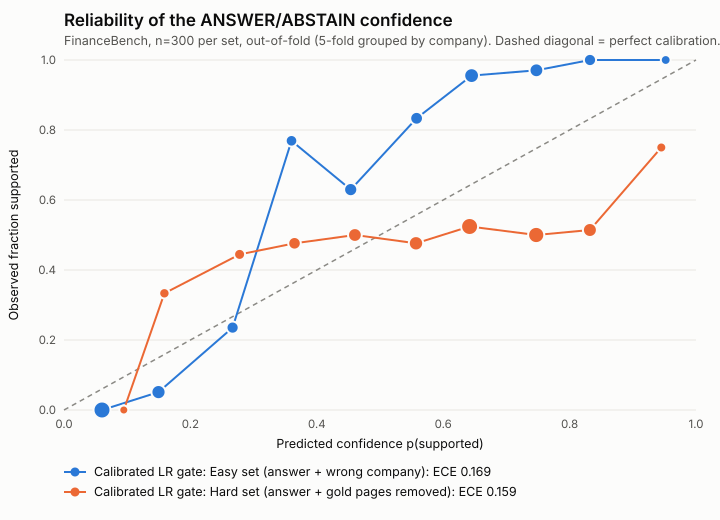

# Filing Lens: Private Cited Answers

Filing Lens lets retail investors ask questions about company filings on their phone and get answers with page citations. A local 3B model (Qwen 2.5, runs on the phone) writes every answer, so the document never leaves the device. A calibrated decision layer checks the retrieved pages before the model runs and abstains when they don't support an answer, showing a confidence score instead of a guess.

**Live:** https://rajyyug1132.github.io/Filing-Lens-Private-Cited-Answers/ (tap **Try a sample 10-K** to skip uploading)

## How it works

```
PDF ─ pdf.js ─▶ page text ─▶ chunks (≤160 words, never cross a page) ─▶ MiniLM-L6 embeddings (ONNX/WASM) ─▶ IndexedDB
question ─▶ hybrid retrieval (dense + BM25, RRF, top-4) ─▶ decision layer: 10 features → logistic regression → ÷T
   p < 0.5 ─▶ ABSTAIN card + closest pages
   p ≥ 0.5 ─▶ Qwen2.5-3B (WebLLM, WebGPU)  |  no WebGPU → Qwen2.5-1.5B Q4_K_M (wllama, WASM CPU)
           ─▶ citation check: every [p.N] must be a retrieved page, ≥50% of sentences cited, else ABSTAIN
```

- **Zero document upload.** pdf.js, the embedding model (23 MB), the ONNX runtime and wllama are npm packages served from the app's own origin. There are no external script tags. The only third-party request is the one-time model weight download (GET, cached by the browser). The e2e test records every request during upload → index → ask → abstain and asserts 0 requests to other origins and 0 requests with a body. Last run: 20 requests, 0 external, 0 with a body (`demo/privacy-log.json`). The in-app pill counts request-body bytes sent by fetch/XHR/beacon.
- **Decision layer** (`lib/retrieve.ts` features, `lib/calibrate.ts` LR + temperature scaling, weights in `lib/decision-model.json`): top-1/mean/margin dense similarity, normalised BM25, question-term coverage in context and in the whole document, dense/BM25 agreement, missing years, question length, and whether the companies or products the question names appear in the filing at all.
- **Citation chips** open the cited page rendered by pdf.js, with a text view.

## Bench (cloud, real numbers)

`npm run bench`, over FinanceBench open-source: 150 questions, 84 real 10-K/10-Q/8-K PDFs. **Gold answer** = the question asked against its own filing (gold answer + gold page exist). **Gold abstain** = the same question asked against a different company's 10-K. 150 + 150, a 1:1 split. 5-fold cross-validation grouped by company, so no company appears in both train and test.

| Gate | Accuracy | ECE ↓ | AUROC | Abstain precision | Abstain recall | Answer rate | Decision latency p50 | Marginal cost / query |
|---|---|---|---|---|---|---|---|---|
| No gate (always answer) | 0.500 | 0.500 | — | — | 0.000 | 1.000 | 0 ms | $0 (on-device) |
| Retrieval score threshold (uncalibrated) | 0.780 | 0.204 | 0.873 | 0.804 | 0.740 | 0.540 | <0.01 ms | $0 (on-device) |
| LR gate, no temperature | 0.910 | 0.045 | 0.972 | 0.930 | 0.887 | 0.523 | 0.28 ms | $0 (on-device) |
| **Calibrated LR gate (LR + temperature, shipped)** | **0.910** | **0.033** | **0.973** | **0.930** | **0.887** | 0.523 | 0.28 ms | $0 (on-device) |
| LLM-router (3B self-check) | pending (Kaggle) | | | | | | | |
| Jev | [ASK: what is Jev + can it run locally] | | | | | | | |

Retrieval recall of the gold page on the 150 answer cases: @1 0.233 · @2 0.333 · @4 0.440 · @8 0.633 · @16 0.733. Retrieval (query embedding + hybrid search) p50 9.5 ms, p95 21.7 ms in Node on a 4-vCPU container with no GPU. Phone latency has not been measured yet.



Generation metrics (citation accuracy, answer accuracy, tokens/sec, LLM-router arm) come from the Kaggle run below. `bench/results/gen_table.md` reads **pending** until `gen_results.jsonl` lands.

### Kaggle generation run (T4)
1. In Kaggle, create a notebook from `bench/kaggle_gen.ipynb` with GPU T4 and Internet on, and run all cells. It fetches `gen_inputs.jsonl` and `prompt.json` from this branch and Qwen2.5-3B-Instruct Q4_K_M from Hugging Face.
2. Download `/kaggle/working/gen_results.jsonl` and commit it to `bench/results/`.
3. Run `python bench/ingest_gen.py`. It writes `gen_table.md` and `gen_metrics.json`; `node deck/build.mjs` picks them up.

Dry run without a GPU: `DRY_RUN=1` executes every cell with a stub model (checked with nbclient). `ingest_gen.py` refuses stub output.

## Run it

```bash
npm ci --ignore-scripts && npm run vendor   # copy pdf.js/ORT/wllama/MiniLM into public/
npm run build && npm run serve              # static export in out/, http://127.0.0.1:4173
npm test                                    # unit tests
npx playwright test                         # e2e (headless Chromium, Pixel 7 emulation) + demo recording
npm rebuild sharp && npm run bench          # cloud bench (needs FinanceBench at bench/.data/financebench)
```

Tests use `?engine=fixture`, which replays `public/fixtures/recorded-responses.json` in place of the model. Those responses are hand-authored for now; replace them with Kaggle-recorded outputs. Everything else in the tests (retrieval, gate, citation check, UI) is real. There is no phone on the build machine, so the e2e suite runs in headless Chromium.

## Data and licences
- **FinanceBench** (Islam et al. 2023, arXiv:2311.11944), github.com/patronus-ai/financebench. The GitHub repo has no LICENSE file (the GitHub API reports `license: null`). The Hugging Face dataset card's licence could not be checked from the build machine because huggingface.co was blocked: **[ASK: confirm FinanceBench licence terms]**. The PDFs are public SEC filings. `tests/fixtures/BESTBUY_2023_10K.pdf` (also the bundled sample) is Best Buy's FY2023 10-K from that repo.
- **all-MiniLM-L6-v2** (Apache-2.0), quantised ONNX vendored via the npm package `@ryanstark24/sfgraph-models` (MIT).
- **Qwen2.5-3B/1.5B-Instruct**: downloaded at runtime by the user's browser, not redistributed here. Check the Qwen licence on the model card before commercial use.

## Limits
- The 3B model was not run on the build machine (its network policy blocks model hosts). Generation quality is pending the Kaggle run.
- Abstain cases are other-company filings. A question the right filing simply doesn't answer is harder and is not in this bench yet.
- Retrieval is the bottleneck: the gold page is in the top-4 for 44% of answer cases.
- Scanned PDFs (no text layer) are rejected; there is no OCR. Tables are read as flattened text.
