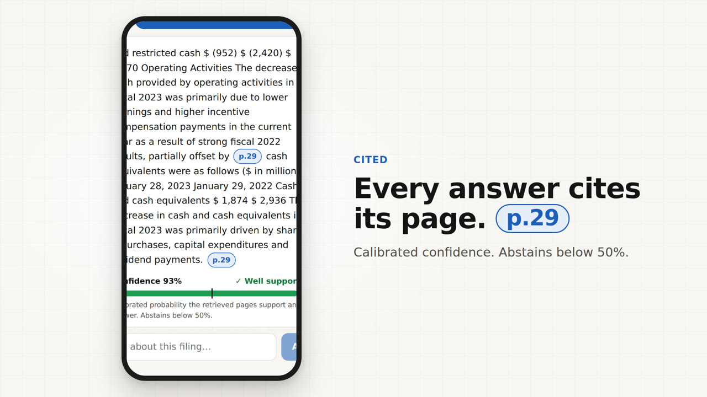
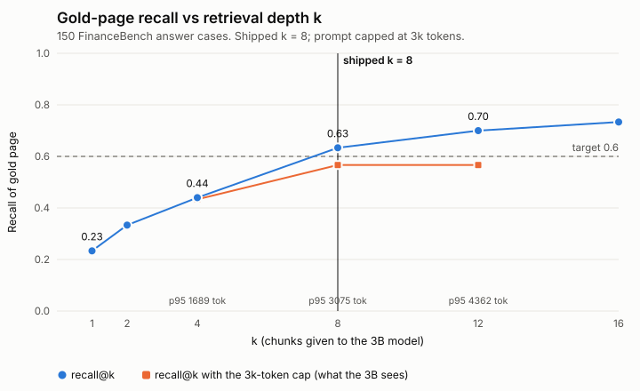

# Filing Lens

**Private, cited answers over company filings.** Ask a 10-K a question on your phone; get an answer with the page it came from, or an honest "I can't answer that from this filing".

[](https://github.com/rajyyug1132/Filing-Lens-Private-Cited-Answers/actions/workflows/pages.yml)


**Live:** https://rajyyug1132.github.io/Filing-Lens-Private-Cited-Answers/ (tap **Try a sample 10-K** to skip uploading)

[](docs/media/filing-lens-launch.mp4)

*21-second launch video ([MP4](docs/media/filing-lens-launch.mp4)). Every phone frame is the real app on the bundled Best Buy FY2023 10-K, with no model downloaded (extractive preview).*

Filing Lens lets retail investors ask questions about company filings on their phone and get answers with page citations. A local 3B model (Qwen 2.5, runs on the phone) writes every answer, so the document never leaves the device. A calibrated decision layer checks the retrieved pages before the model runs and abstains when they don't support an answer, showing a confidence score instead of a guess.

## Contents
- [How it works](#how-it-works)
- [Run it](#run-it)
- [Repository layout](#repository-layout)
- [Bench (cloud, real numbers)](#bench-cloud-real-numbers)
- [Limits](#limits)
- [Data and licences](#data-and-licences)

## How it works

```
PDF ─ pdf.js ─▶ page text ─▶ chunks (≤160 words, never cross a page) ─▶ MiniLM-L6 embeddings (ONNX/WASM) ─▶ IndexedDB
question ─▶ hybrid retrieval (dense + BM25, RRF, k=8, prompt capped at 3000 tokens)
   ─▶ ① feature gate: 12 features → logistic regression ÷ T      p < 0.5 → ABSTAIN (the 3B never runs)
   ─▶ sentence snippets (≤2,200 chars, each tagged [p.N])
   ─▶ ② (Strict mode only, off by default) DSPy verifier on the 3B: ANSWER / ABSTAIN   ABSTAIN → ABSTAIN
   ─▶ DSPy cited answer on the 3B ─▶ every [p.N] must be a snippet page     else ABSTAIN
3B: Qwen2.5-3B-Instruct (WebLLM, WebGPU) | no WebGPU → Qwen2.5-1.5B Q4_K_M (wllama, WASM)
```

- **Zero document upload.** pdf.js, the embedding model, the ONNX runtime and wllama are npm packages served from the app's own origin. There are no external script tags. The only third-party request is the one-time model weight download (GET, cached). The e2e test records every request during upload → ask → answer → abstain and asserts 0 requests to other origins and 0 requests with a body (last run: 20 requests, 0 external, 0 with a body).
- **Feature gate** (`lib/retrieve.ts`, `lib/calibrate.ts`, `lib/decision-model.json`): retrieval-score, word-coverage, entity and year features; class-balanced logistic regression with temperature scaling. It is cheap (0.41 ms) but cannot read content.
- **Verifier + answerer** are a DSPy program (`bench/lens_program.py`) compiled on Kaggle and exported to `app/prompts/verifier.json`. `lib/dspy-chat.ts` rebuilds DSPy's ChatAdapter prompt in the browser, and `tests/unit/dspy-chat.test.ts` asserts it is identical to DSPy's own rendering. The app ships the program compiled on Kaggle: BootstrapFewShot with 2 demos per predictor (MIPROv2 light was tried and not kept, since its balanced dev score of 0.519 was below 0.548).

## Run it

```bash
npm ci --ignore-scripts && npm run vendor   # copy pdf.js/ORT/wllama/MiniLM into public/
npm run build && npm run serve              # static export in out/, http://127.0.0.1:4173
npm test                                    # unit tests
npx playwright test                         # e2e (headless Chromium, Pixel 7 emulation) + demo recording
npm rebuild sharp && npm run bench          # cloud bench (needs FinanceBench at bench/.data/financebench)
```

Tests use `?engine=fixture`, which replays `public/fixtures/recorded-responses.json` (ChatAdapter-format completions) in place of the model. Those responses are hand-authored for now; replace them with Kaggle-recorded outputs. Everything else in the tests is real: retrieval, gate, DSPy prompt builder and parser, citation check, UI. There is no phone on the build machine, so the e2e suite runs in headless Chromium.

## Repository layout

| Path | What's there |
|---|---|
| `app/`, `components/` | Next.js static-export PWA: upload, ask bar, answer and abstain cards, page and privacy sheets |
| `lib/` | Pipeline: pdf.js text, chunking, BM25 + dense retrieval, feature gate, snippets, DSPy prompt builder, citation check, engines |
| `app/prompts/verifier.json` | DSPy program compiled on Kaggle, rebuilt byte-for-byte in the browser |
| `public/` | Service worker, vendored runtimes and models (copied from npm by `scripts/`), pre-indexed sample filing |
| `bench/` | Cloud bench (`run.ts`), Kaggle notebook, DSPy program and export, ingest, results |
| `tests/` | Unit tests (`unit/`) and Playwright e2e with the privacy assertion (`e2e/`) |
| `deck/` | 8-slide deck built from the bench outputs (`build.mjs` → `FilingLens.pdf`) |
| `demo/` | Demo script, e2e recording, screenshots, privacy log |
| `docs/media/` | Launch video and poster |

## Bench (cloud, real numbers)

`npm run bench` runs over FinanceBench open-source: 150 questions and 84 real 10-K/10-Q/8-K PDFs. There are three sets, never merged:
- **gold answer:** the question asked against its own filing
- **Easy abstain:** the same question asked against another company's 10-K from the **same CV fold**, so no filing appears in more than one fold
- **Hard abstain:** the question asked against its own filing with the gold pages removed, **plus any other page that still contains every gold number**. Questions whose retrieved context still contains the answer are excluded (10 of 150), leaving 140.

One gate is trained on all 440 instances (class-weighted to 50/50) with 5-fold CV grouped by company, then scored separately on Easy (answer + Easy) and Hard (answer + Hard).

### Feature gate (out-of-fold, all 440)

| Gate | Easy acc. | Easy ECE ↓ | Easy abstain P / R | Hard acc. | Hard ECE ↓ | Hard abstain P / R | Decision latency p50 |
|---|---|---|---|---|---|---|---|
| No gate (always answer) | 0.500 | 0.500 | — / 0.000 | 0.517 | 0.483 | — / 0.000 | 0 ms |
| Retrieval score threshold (uncalibrated) | 0.620 | 0.248 | 0.569 / 0.993 | 0.528 | 0.076 | 0.507 / 0.829 | <0.01 ms |
| LR gate, no temperature | 0.870 | 0.161 | 0.828 / 0.933 | 0.524 | 0.139 | 0.517 / 0.221 | 0.42 ms |
| Calibrated LR gate (LR + temperature), shipped (v2 features) | 0.870 | 0.149 | 0.828 / 0.933 | 0.524 | 0.151 | 0.517 / 0.221 | 0.42 ms |

Hard accuracy with v1 features was 0.528 (< 0.75), so the gate was retrained once with two "does the top passage answer this kind of question" features. Before → after: Easy acc 0.853 → 0.870, Easy ECE 0.152 → 0.149; Hard acc 0.528 → 0.524, Hard ECE 0.147 → 0.151.

Recall of the gold page (150 answer cases): @1 0.233 · @2 0.333 · @4 0.440 · @8 0.633 · @12 0.700 · @16 0.733

Prompt tokens before the cap (system + question + k chunks, Qwen tokenizer proxy): k=4: p50 1193, p95 1689, max 2100 · k=8: p50 2253, p95 3075, max 3586 · k=12: p50 3261, p95 4362, max 4964

With the 3000-token cap (drop lowest-ranked chunks; 0.411 tokens/char estimate): k=4: recall 0.433, mean 4.0 chunks, max 1843 tokens · k=8: recall 0.567, mean 6.4 chunks, max 2750 tokens · k=12: recall 0.567, mean 6.4 chunks, max 2750 tokens

**Shipped k = 8** (no k reached recall 0.6 under the 3000-token cap; k with the highest capped recall).

Sentence snippets (what the verifier reads, ≤2,200 chars): gold page present in 52.7% of answer cases; verifier prompt with 2 worst-case demos: p95 2295, max 2405 tokens.

Hard set: annotated gold pages plus 252 other pages that still contained every gold number were removed; 10 questions were excluded because the retrieved context still contained the answer (4 by numbers, 6 by answer terms), leaving 140. Easy abstains use another company's 10-K from the same CV fold, so no filing crosses folds.

Sets: 150 answer, 150 Easy, 140 Hard; one gate trained on all of them with 5-fold CV grouped by company; Easy and Hard scored separately. Retrieval (query embed + hybrid search) p50 9.47 ms, p95 22.41 ms on Node v22.22.0, 4 vCPU container, no GPU.

**Hard ceiling of the feature gate: 0.52** on the cleaned Hard set, where always answering scores 0.517 (150 answer vs 140 Hard). It sees retrieval scores and word overlap, not content, so "the gold page" and "a nearby page about the same metric" look the same to it. The extra "top passage answers this kind of question" features did not move it. That gap is what the verifier is for.



**k selection:** among k = 4, 8 and 12, no k reaches recall 0.6 once the prompt is capped at 3,000 tokens. Uncapped k=8 has recall 0.633 but a p95 prompt of 3075 tokens. Capped, it gives 0.567, the highest of the three, so k=8 with the cap ships. Token counts in the bench come from the Qwen3.5 tokenizer on npm as a proxy. The Kaggle run measured the real Qwen2.5 tokenizer and chat template on the compiled prompts (`bench/results/token_counts.json`): verifier max 2,632 (p95 2,514), answerer max 2,567 (p95 2,449), both within the 3,000-token budget. Reranker: skipped. No npm package ships cross-encoder weights; the one candidate downloads from Hugging Face at runtime and is AGPL-3.0.

### Cascade (test split)

| System | Easy acc. | Hard acc. | ECE ↓ (Easy / Hard) | Citation page match | p50 latency | Verifier calls |
|---|---|---|---|---|---|---|
| Feature gate only | 0.864 | 0.524 | 0.192 / 0.156 | 0.279 (top-ranked page) | 0.42 ms | 0% |
| Verifier only (fp16_llamacpp) | 0.509 | 0.495 | 0.476 / 0.496 | 0.500 | 7447 ms | 100% |
| Cascade: gate → verifier (fp16_llamacpp) | 0.518 | 0.495 | 0.392 / 0.404 | 0.500 | 7202 ms | 52% |
| Verifier only (gguf_q4) | 0.527 | 0.495 | 0.468 / 0.474 | 0.500 | 7156 ms | 100% |
| Cascade: gate → verifier (gguf_q4) | 0.536 | 0.495 | 0.410 / 0.391 | 0.500 | 6939 ms | 52% |

Test split only: 160 instances (company-grouped): 55 answer, 55 Easy, 50 Hard. Only 27 of the 55 answer cases have a gold page in the snippets, which caps citation page match and answer accuracy. Gate latency: features + LR on Node v22.22.0, 4 vCPU container, no GPU; verifier latency: one verifier call on the Kaggle T4 build named in the row. Retrieval (shared by all rows) is not included.

**Verifier result (real, Kaggle T4):** the compiled verifier abstains on nearly everything. It says ANSWER on 2 of 55 answer cases (fp16) and 4 of 55 (Q4), so it adds almost nothing over always-abstain: Easy 0.509 / 0.527, Hard 0.495. Behind the gate it also drags Easy accuracy from 0.864 to 0.518 / 0.536. Auto-graded answer accuracy on the gold-answer cases: 0.018 (fp16), 0.036 (Q4). Generation ran at a median 3.6 / 3.8 tokens/s on llama.cpp (vLLM failed to start on the T4). Compile dev score was 0.548 against an always-abstain baseline of 0.5, so the BootstrapFewShot program did not learn to recognise an answerable context from 2 demos and 3B weights. Raw per-instance output: `bench/results/cascade_results.jsonl`.
### Kaggle run (T4)
1. Merge to `main` (the notebook reads its inputs from `main`). Import `bench/kaggle_gen.ipynb` with GPU T4 and Internet on, and Run All. It serves Qwen2.5-3B fp16 with vLLM (`dtype=half`, since the T4 has no bf16; if vLLM won't start it falls back to llama.cpp on the fp16 GGUF), logs exact Qwen2.5 token counts for the worst-case prompts (`token_counts.json`), compiles `Lens` with BootstrapFewShot (2 demos) on the train split, optionally runs MIPROv2 light (kept only if dev improves), then evaluates on the test split with fp16 and with the GGUF Q4_K_M build (llama.cpp).
2. Download `cascade_results.jsonl`, `token_counts.json`, `app_verifier.json` and `verifier.json`. Commit `app_verifier.json` as `app/prompts/verifier.json`, and the rest to `bench/results/`.
3. Run `python bench/ingest_gen.py && npm test && node deck/build.mjs` after copying the files into `bench/results/`.

`DRY_RUN=1` executes every notebook cell on CPU with DSPy's DummyLM (checked with nbclient). `ingest_gen.py` refuses stub output.

## Limits
- The feature gate can't see content: Hard accuracy 0.52. The DSPy-compiled 3B verifier didn't fix that: it abstains on 51–53 of 55 answer cases (Hard 0.495). So the verifier ships **off by default** as an opt-in Strict mode; the default path is gate → cited answer → citation check, and the gate alone is the stronger Easy filter (0.864). Answer accuracy of that default path with the 3B has not been measured (the Kaggle run only generated answers after the verifier).
- Retrieval is the bottleneck: gold-page recall@4 0.440, @8 0.633. Under the 3k cap the 3B sees the gold page 57% of the time, and the sentence snippets keep it 53% of the time.
- A failure found and fixed: Best Buy's 10-K never mentions Walmart, yet "Walmart capex?" passed the gate. Adding a feature for whether the companies a question names appear in the filing fixed it (0.820 → 0.910 on the earlier own-vs-wrong-company bench; `bench/results/history.json`).
- Answers are auto-graded (number within 1%, else token-F1), an approximation of FinanceBench's human grading.
- Scanned PDFs (no text layer) are rejected; there is no OCR. Tables are read as flattened text.

## Data and licences
- **FinanceBench** (Islam et al. 2023, arXiv:2311.11944), github.com/patronus-ai/financebench. The GitHub repo has no LICENSE file (the GitHub API reports `license: null`). The Hugging Face dataset card (PatronusAI/financebench) is reported as **CC-BY-NC-4.0**; this could not be checked from the build machine because huggingface.co was blocked (**[ASK: confirm on the card]**). It is used here only for non-commercial evaluation. The PDFs are public SEC filings. `tests/fixtures/BESTBUY_2023_10K.pdf` (also the bundled sample) is Best Buy's FY2023 10-K from that repo.
- **all-MiniLM-L6-v2** (Apache-2.0), quantised ONNX vendored via the npm package `@ryanstark24/sfgraph-models` (MIT).
- **Qwen2.5-3B/1.5B-Instruct**: downloaded at runtime by the user's browser, not redistributed here. Check the Qwen licence on the model card before commercial use.
